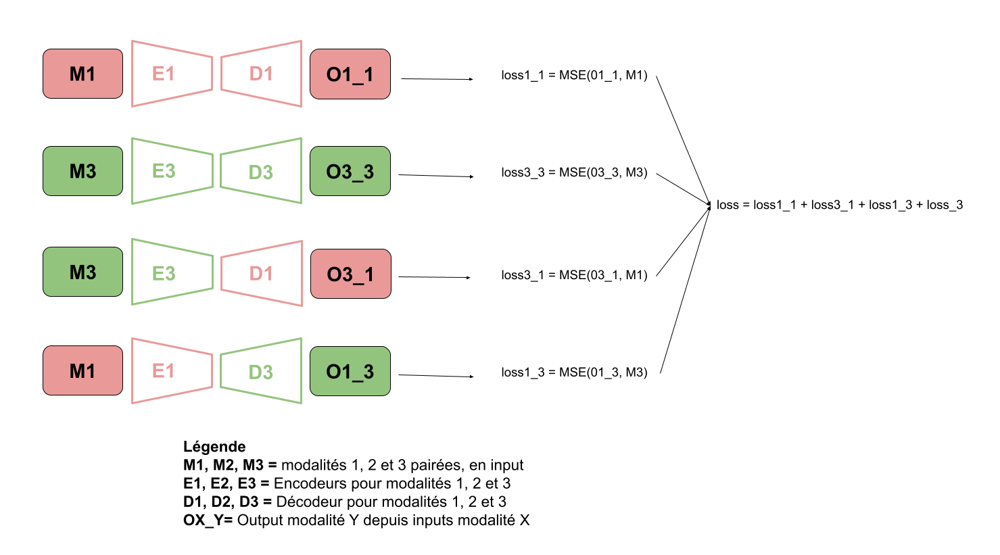
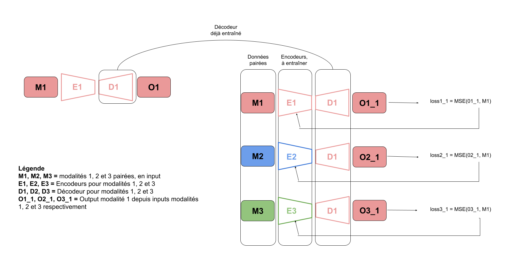

# Multi-omic generation

Collaborative project with l'INSEE aimed at generating omic data while considering other modalities, facilitating comprehensive data analysis and interpretation.

## Installation

To install the required dependencies, run the following command:

 ```bash
pip install -r requirements.txt
```

## Datasets

We study three modalities : expression, methylation, protein.
The function generate_datasets from the datasets.py file returns thee datasets for training, testing or both.

example:
```python
datasets = generate_datasets(suffix='5_diff', type='unpaired', train=True, test=False)
# Generate the dataloaders
dataloaders = [DataLoader(ds, batch_size=32, drop_last=True, shuffle=False) for ds in test_datasets]
```

## Models 

This repository provides implementations of several multi-omic generation models. Below, you'll find descriptions of two of them, which we considered as our baselines:

## Model 1
This model uses an encoder and decoder for each modality, and trains all combinations of them, conjointly. The aim is to train all encoders to generate a latent space that suits all decoders, and decoders to generate the good modality. To learn conjointly, losses are added and backpropagation is made from the total loss. 

The advantage of this method is that the encoders and decoders learn both to generate a modality from itself and from another. This prevents the model from learning autoencoders that, regardless of the latent space, attempt to generate a certain modality. Working on noise would produce the same effect.

<div style="background-color: white; padding: 10px; border-radius: 5px;">

</div>

## Model 2
This model uses a pre-trained decoder for the modality we want to generate, and an encoder for each modality. The goal is to train all encoders to generate a latent space that fits the pre-trained decoder.

The advantage of this method is that the pre-trained decoder expects a certain latent space to properly generate the modality. Thus, the encoders each learn to generate this latent space. However, for these models to work, the decoder must be efficient

<div style="background-color: white; padding: 10px; border-radius: 5px;">

</div>

## Launch training

For training just run the training notebook  `train_models_1_and_2.ipynb`.

The trained model is store in the `./checkpoint` folder.

